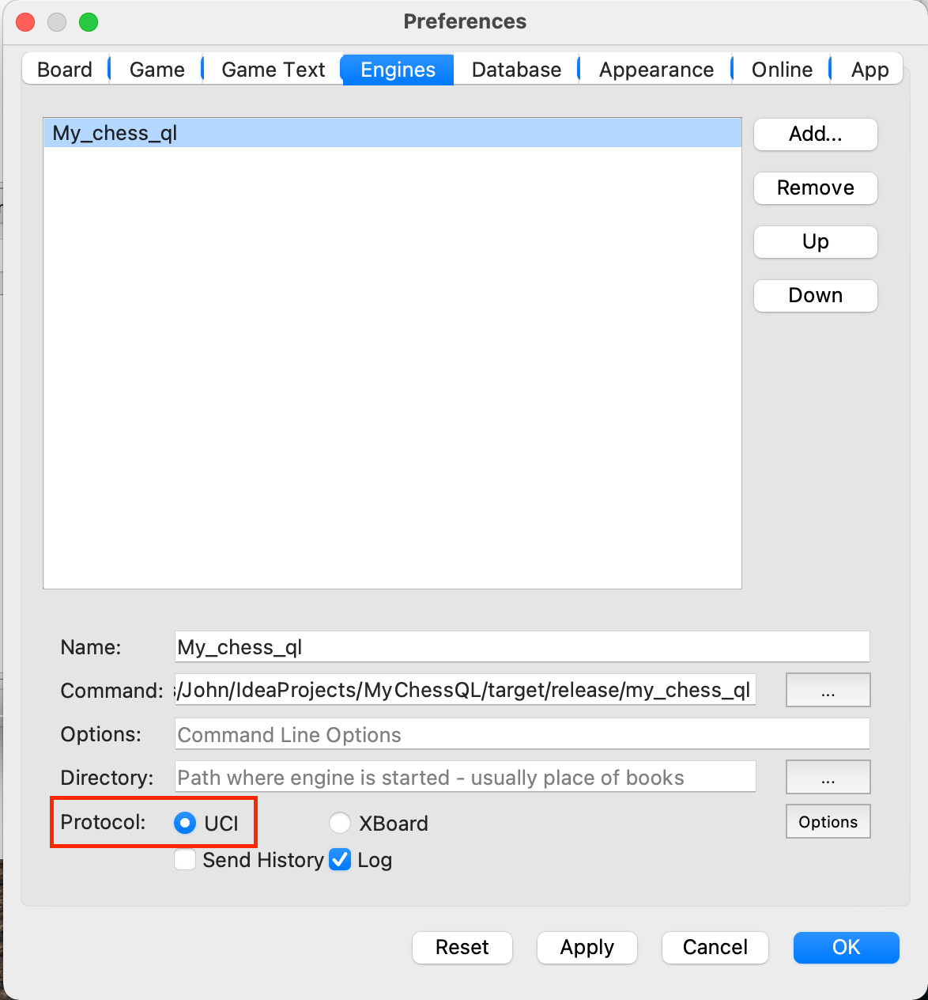
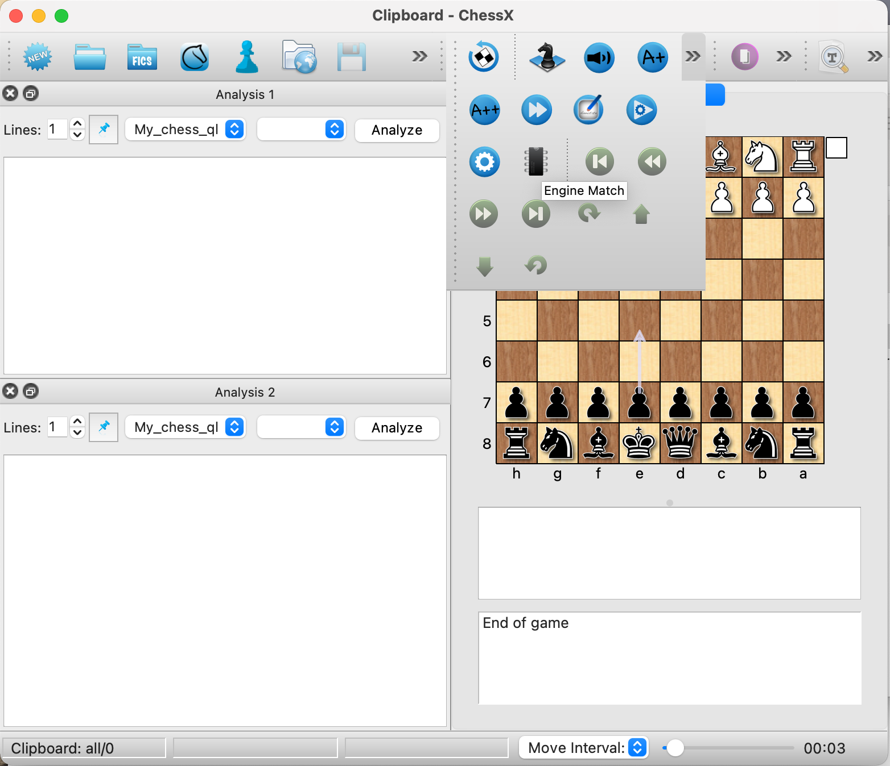
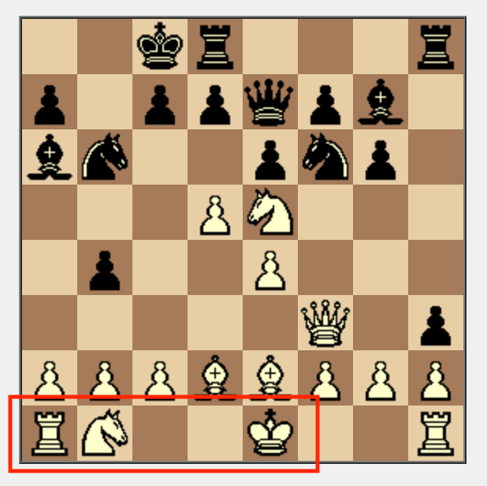
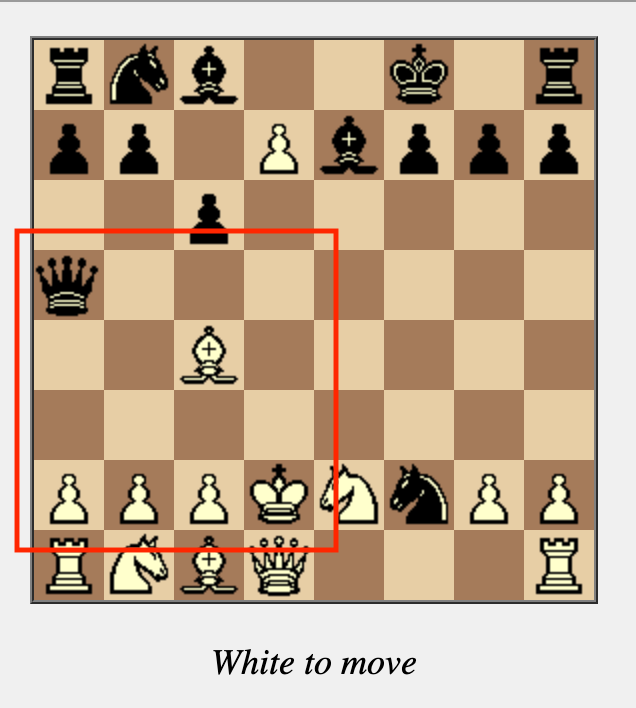
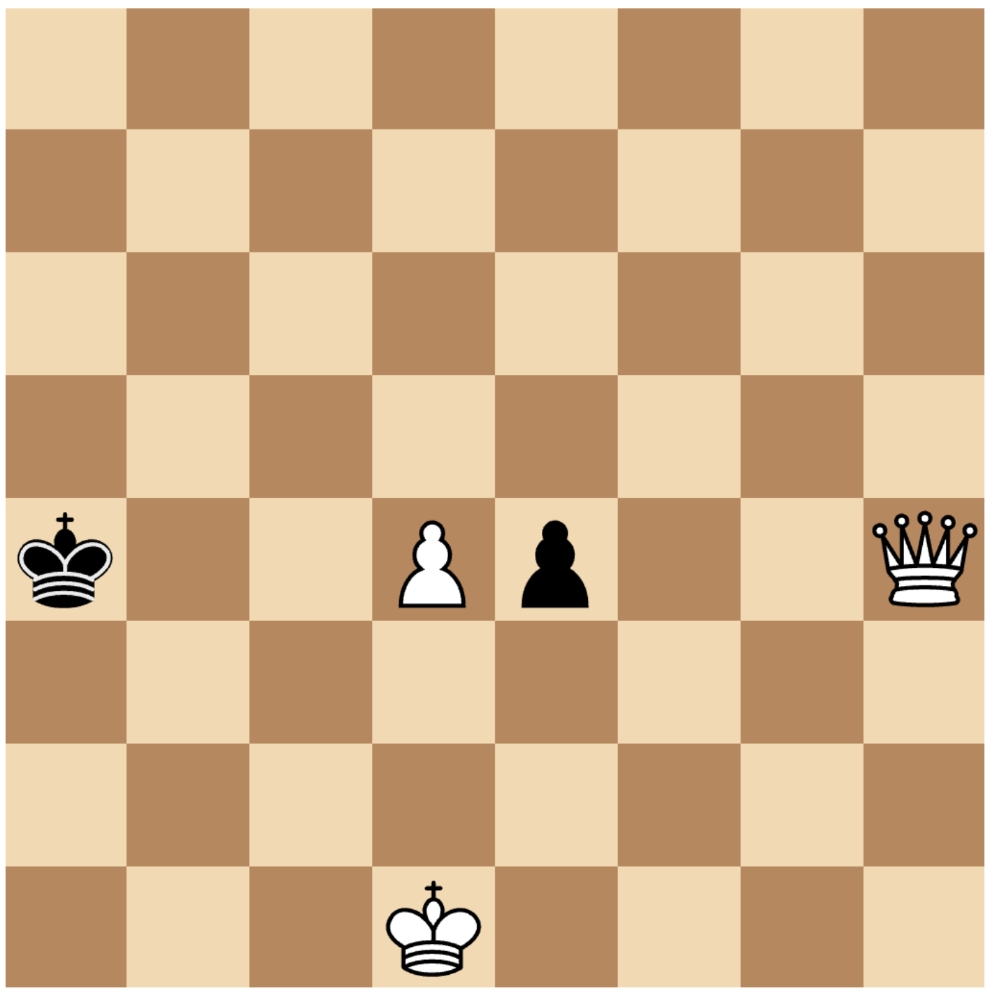

# MyChessQL
My fun little attempt at writing a chess engine.  Why?  Because I like to torture myself.

**NOTE: the engine currently only makes random moves since just the Move Generator part of the program is currently working.**

This engine uses [bitboards](https://www.chessprogramming.org/Bitboards) to represent the placement of the various pieces on the board for lightning-fast calculations since often the movements or attack squares for multiple pieces can be computed at the same time (e.g. pawns), and most operations can be reduced to bitwise operations using unsigned 64-bit integers which are very fast (as compared to looping).

---
## Installation
1. **Download the [release](./release/my_chess_ql) file** (for now, only compiled for x86/x64 architectures)
2. **Run it directly** if you want to see how it works - it is a backend program that is intended to work with a separate chess UI program using the [Universal Chess Interface](https://www.chessprogramming.org/UCI) (UCI) protocol.  An example session might look like that shown below (`<--` indicates a command being sent to the engine, while `-->` indicates a response):
```
<-- uci
--> id name MyChessQL
--> id author John Pazzelli
--> uciok

<-- isready
--> readyok

<-- stop
<-- ucinewgame
<-- isready
--> readyok

<-- position fen rnbqkbnr/pppppppp/8/8/7P/8/PPPPPPP1/RNBQKBNR b KQkq h3 0 1
<-- go movetime 3000
--> bestmove g7g6
```
This shows the current board position being sent to the program in [Forsyth-Edwards Notation (FEN)](https://www.chessprogramming.org/Forsyth-Edwards_Notation) after the move `1. h4` was just played by white and the engine replying with `1. ... g6`
3. If you'd rather try it out in a chess UI program, download something like [ChessX](https://sourceforge.net/projects/chessx/), open the **Settings (or Preferences) --> Engines** tab and Add the **my_chess_ql** engine file that was just downloaded.  Ensure the protocol is set to **UCI**



4. Once added, you can start an **Engine Match** to watch it play against itself or a **Match against Engine** to play against it yourself.  Below is a sample video of the engine playing against itself:
   
[](./docs/installation/MyChessQLEngineSelfPlay.mov)

---
## Major Components
### 1. Move Generator
This was a surprising amount of work since the use of bitboards makes the calculations tricky, and there are many [edge cases](https://peterellisjones.com/posts/generating-legal-chess-moves-efficiently/) to consider.

I got this working perfectly by:
- **Writing specific, targeted unit test cases** to ensure proper movement of pieces as well as handling of captures, pins, checks, etc.
- **Comparing my results to the published, [perft results](https://www.chessprogramming.org/Perft_Results#Initial_Position)** at different depths of the game search tree.  For example, from the starting position, there are exactly **119,060,324** possible positions that can be reached (ignoring transpositions) after 6 moves.  This is used to validate that the move generator logic is working correctly.
- When my totals mismatched from the published ones, I found the remaining bugs by creating an [intense verification](https://github.com/pazzelli/my_chess_ql/blob/master/src/test/LegalMovesHelper.rs#L138) mode that:
  - **compares the values in the current, reused position object to a freshly-generated one**.  This helped to find bugs that occur by reusing the same position object while searching up and down the game tree (this object is reused for better performance)
  - **[compares each position traversed in the tree to the output produced by stockfish](https://github.com/pazzelli/my_chess_ql/blob/master/src/test/LegalMovesHelper.rs#L271)** (the world's current #1 chess engine) to look for mismatches

The **move generator performance is currently around 2M positions/s** which may sound fast, however the speed of the **perft** program itself is around 225M positions/s on my laptop.  There is definitely some room to improve performance, however I will move on to the neural network portion of the project and come back to this later.

### 2. Neural Network to Analyze Positions
Coming soon

### 3. Search Tree to Choose Better Moves
Coming soon 


---
## Stuff I Learned
1. The [Rust](https://www.rust-lang.org/) programming language!  I had never used it prior to this project and I really like it now.  There was a bit of a learning curve when it came to learning the [borrowing and references system](https://doc.rust-lang.org/book/ch04-02-references-and-borrowing.html) but it's pretty powerful once you understand it.  It helps prevent bugs and allows you to achieve high performance (which was important to me for this project) by **not needing a garbage collector** - this is awesome!


2. When trying to get high performance:
- **using any data that is dynamically-allocated on the heap (e.g. reference types such as *Vectors*), slows things down considerably**.  The overhead of allocating and freeing this memory at run-time is considerable as compared to the speed of running bitwise arithmetic operations, so arrays are often used to make things faster since their sizes are known at compile time.

- **using bitboards and writing everything as bitwise operations is hard**.  It's difficult to conceptualize what all the bits will look like and to handle the complex scenarios that arise in chess using simple bitwise operations alone.

## Fun Bugs I Fixed
1. **Castling through a Knight**: when comparing my output to Stockfish, I found that my code was allowing white to castle queenside through his own knight here:

  
  
2. **Check Blocking Difficulties**: my code was initially not allowing white to play `b4` here to block the check from the black queen since the logic to look for enemy checks against the king as well as the logic to check if the square immediately in front of the pawn was empty got jumbled up, thus not realizing that the check could be blocked by advancing two squares instead:
   


3. **This Crazy Position**: assuming white has just played `d4` here, black actually cannot capture en-passant since it would remove both pawns from the 4th rank and expose the black king to check:
   


After this, the move generator finally worked correctly, and boy was it a lot of work!
